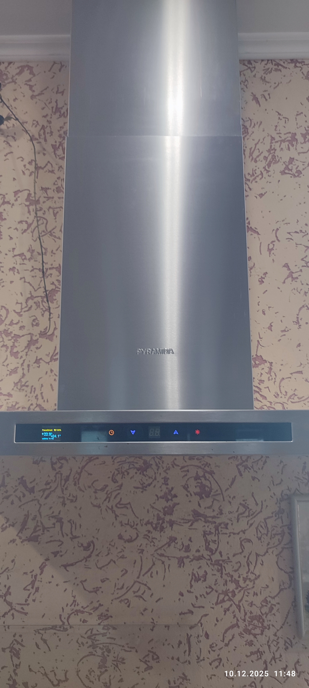

# Parus-Hood: Умная Автоматизированная Кухонная вытяжка на ESPHome

  

    
    
    
    

## 🌟 Описание Проекта

Без вытяжки над плитой при приготовлении пищи трудно обойтись, иначе - влага, запахи, дым и жир будут распространяться по всей кухне и оседать на предметах. Но вовремя включать и выключать вытяжку при её наличии тоже не всем под силу - спешка и забывчивость тоже имеют место. Есть много разных алгоритмов для автоматизации кухонной вытяжки, и на мой взгляд, самый лучший, предлагаю вашему вниманию.

## Основные возможности:
- **Автоматическое управление**: Вытяжка включается при включении газа, выбирает нужный режим скорости, и отключается при выключении газа.
- **Ручное управление (и ввод настроек)**: Через штатное сенсорное управление, Home Assistant, Яндекс (Алиса), Web страница ESPHome.
- **Таймер**: Настраиваемый таймер до отключения вытяжки.
- **Отключаемые авторежимы**: Можно отключать и включать авторежимы вытяжки и подсветки из штатного управления.
- **Мониторинг**: OLED-дисплей показывает статус, батарею, время и причины пробуждения.
- **Интеграция**: Полная совместимость с Home Assistant для удаленного управления и мониторинга.

---

## 🚀 Ключевые Функции

### Автоматизация
- **Режим "Солнце"**: Штора раборает по восходу и закату (с настраиваемым оффсетом угла солнца).
- **Режим "Время"**: Устанавливаемое время открытия и закрытия (например, 07:00–18:00).
- **Авто/Ручной режим**: Включение/отключение автоматического управления. В ручном режиме управляет шторой только при пробуждении по таймеру.
- **Глубокий сон**: ESP32 засыпает до следующего события, экономя батарею.
- **Автокоррекция**: Возможность коррекции положения шторы по геркону при открытии.

### Управление
- **Сенсорная клавиатура**: Штатные сенсорные кнопки для управления.
- **Home Assistant**: Полный контроль через API (скорости, подсветка, настройка).
- **Яндекс (Алиса)**:  При подключении через Home Assistant управление скоростями и подсветкой
- **web страница ESPHome**: Удаленное управление из любого места через любой браузер по ip адресу устройства.

### Основные Компоненты
- **Микроконтроллер**: ESP32(низкое энергопотребление, Wi-Fi/BLE).
- **Дисплей**: OLED SSD1306 I2C (128x64, для отображения статуса).

---

## 📊 Скриншоты и Видео

- [yaml файл прошивки](hood.yaml)
- [внешний вид](img/main.jpg)
- [блок управления1](img/1.png)
- [блок управления2](img/2.png)
- [ручки с датчиками Холла ](img/sensors.jpg)
- [Видео#1 YOUTUBE](https://youtu.be/nVWKVWntuA0)

---

## 📄 Лицензия

Этот проект распространяется под лицензией MIT. Используйте на свой страх и риск.

---

##  Дополнительные источники информации

Телеграм канал https://t.me/parus_smart

---
## 🙏 Благодарности

- ESPHome сообществу за отличный фреймворк.
- Home Assistant за интеграцию.
- Вам за использование! Если проект полезен, поставьте ⭐ на GitHub.

---

*Создано с ❤️ ParusSmartHome. Версия: 10.12.2025*
